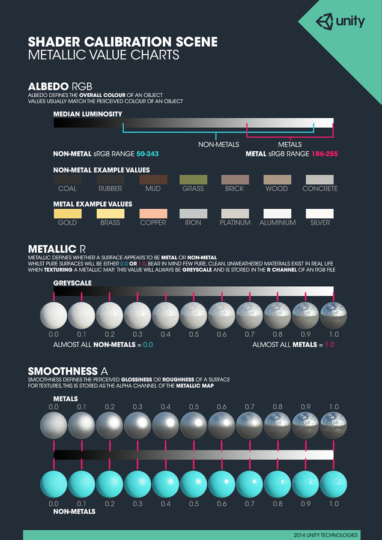
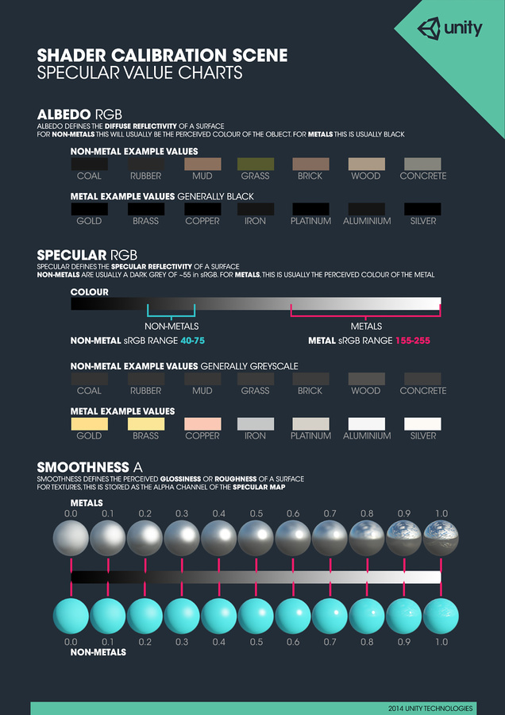

---  
layout: post  
title:  "常见物体固有色"  
author: © 2018 Unity Technologies  
---  

# 金属

# 镜面

--***出自[unity用户手册](https://docs.unity3d.com/2018.1/Documentation/Manual/StandardShaderMaterialCharts.html)***