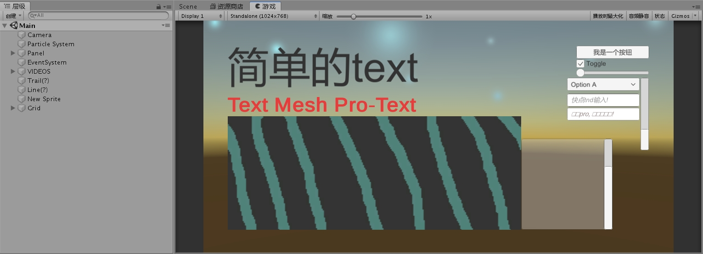
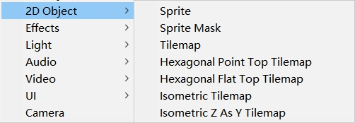
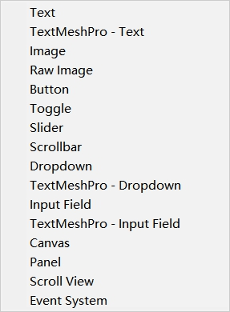
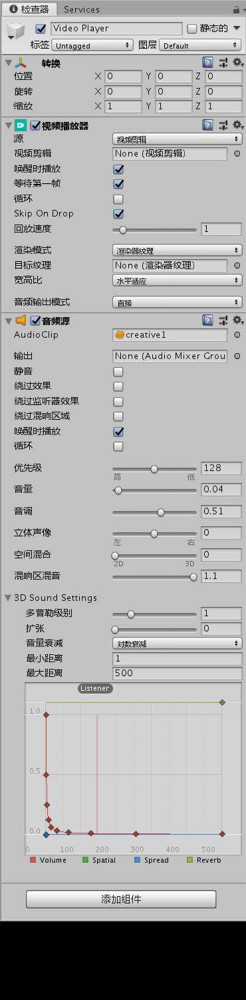
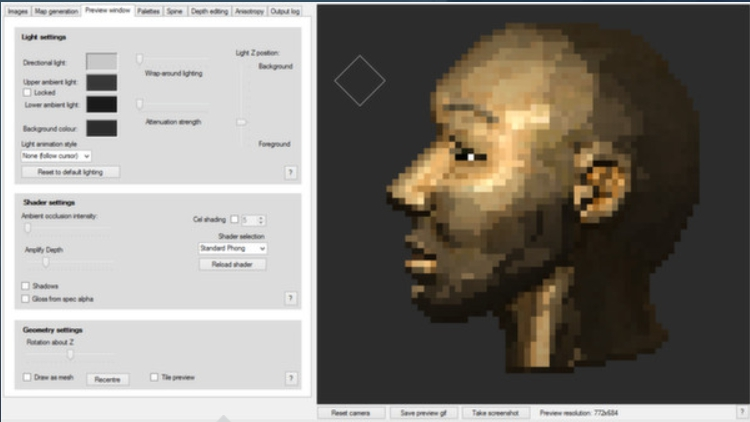

---  
layout: post  
title:  "unity完全新手入门-2d"  
author: yaoz  
---  
  
# 快速上手  
刚开始接触unity, 可能对游戏引擎一点了解都没有  
不过首先你需要下载unity(此处推荐一下unity Hub, 可以对不同版本项目进行管理, 而且有中文版菜单栏用)  
↓然后把所有能加的东西都加一遍看看是什么牛鬼蛇神  
  
  
## unity-2d可以做什么  
  
### 2d对象  
首先肯定可以加2d对象...  

  
- Sprite-精灵  
  精灵其实就是一个需要显示出来的最基本的单位  
- 精灵遮罩  
  多了一个叫遮罩的东西, 遮罩的概念就是字面意思, ~~鬼刀一开看不见~~只是遮罩本身可能是看不见的
- > Tilemap-瓦片地图  
  > 六边形点状瓦片  
  > 六边形面瓦片  
  > 等距瓦片  
  > 等距瓦片(z轴当做y轴)  
  瓦片地图, 想想泰拉瑞亚, 什么你没玩过泰拉瑞亚?想想超级马里奥, 马里奥是什么?你卸载unity吧  
  
### UI  
还是建议全部添加一遍

  
- Text-文本/富文本  
  其中, 富文本采用xml标签语言  
  关于TextMeshPro还有一个[英文文档](http://digitalnativestudios.com/textmeshpro/docs/), 可以去看一看  
- Image-图片/原始图像  
  图片需要一个精灵资源来显示自己  
- Toggle-切换(CheckBox:¿)  
- Button-按钮  
- Slider-滑动条  
  音量加大!!  
- Scrollbar-滚动条  
  浏览器右边也有一个
- Dropdown-列表框  
- InputField-输入框  
- Scroll View-滚动视图  
- Panel-面板  
  
### 音频  
音频里有一些设置效果比较显著:  
  
- 音调(pitch)  
- 3D混响  
  
建议戴上耳机找首歌自己diy一会  
  
  
### 视频  
硬盘里没有多少视频所以这部分暂时不写  

### 粒子  
粒子系统建议换成中文玩一玩, 每个选项都打开  
建议把起始速度和起始大小调大一些(效果更明显)  

### 灯光  
你以为2D就没有灯光?NATIVE!  
此处推荐 **Sprite Lamp**  
借用steam的图片, 可以想象这个技术对画质提升有多大的帮助  
  