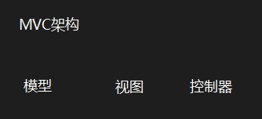
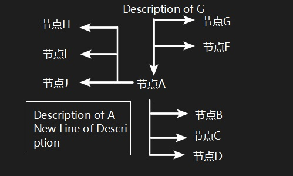
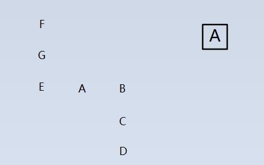
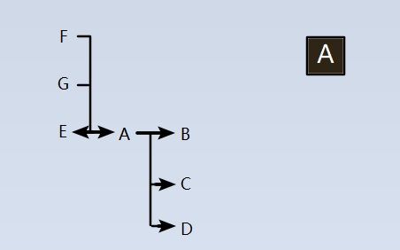
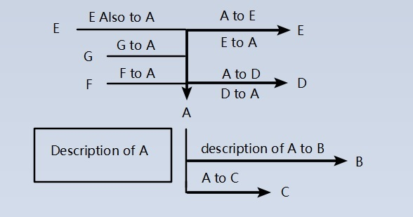

# **MindLet 项目策划**
[点击传送门体验MindLet](../src/MindLet/MindLet.html)
---

## 项目由来
用过很多思维导图软件, 但是没有软件渲染导图就没法编辑  
markdown能轻松排版文档, 但是没有文档内部之间的跳转(需要手动写html)

---

## 功能

### 编辑:  
清晰的标识出节点及其联结, 联结说明  

### 使用:  

在没有程序渲染思维导图时, 仅查看文本文件也可以纵览整个思维导图, 从而修改重要的地方  

### 特点:
无需用户标记节点位置, 渲染时自动判断  
语言特性, 有自己的语法  

---

## 缺陷
* 编辑不便
* 相同节点与相同联结
* 有向有环图

---

## 可能加入的特性
图片节点(但是对于文本操作可读性很差)  
坐标控制(渲染需要判断是否连通图)  
标签(在过于复杂, 可读性差的情况下)  
多节点到多节点的拓扑(多个节点'同时'连到一个节点上, 可读性更差了)  

---

## 如何使用项目
语法示例:

> \# MVC架构  
> 一种web应用框架
> 
> \# 模型  
> 
> [控制器]返回响应/模型
> 
> \# 视图  
> 
> [控制器]提交动作
> 
> \# 控制器  
> 
> [模型]提交查询  
> [视图]返回数据并由View渲染

* 以#开头的行会被解析为一个节点   
* 若图存在环路, 解析时会暂时忽视一些联结
* []中表示联结到的节点, 之后是对联结的说明  

若节点名重复, 则其前向会同时连接到所有同名节点  
最后, 以上文本将被解析为下图:  


### 视图

#### Single/All模式
将所有节点保存之后, 默认仅显示节点  
用户可以选择显示连接线/不显示连接线(显示连接线可能会很乱)  

* 当鼠标单击该节点时, 会隐藏所有不相关节点, 并重新排列视图, 进入Single模式  
* 当鼠标右击任意位置, 会返回All模式  
* 当鼠标悬停在某个节点上时, 会单独显示该节点相关的所有连接线  

下图是一个Single模式的视图格式  

  

它由五个部分组成:

* 前向
* 后继
* 环路
* 节点
* 节点信息

### 解析

示例文本

> \# A
> Description of A  
> [B]description of A to B  
> [C]A to C  
> [D]A to D  
> [E]A to E
> 
> \# B  
> 
> \# C  
> 
> \# D  
> [A]D to A  
> 
> \# E  
> [A]E to A  
> [A]E also to A  
> 
> \# F  
> [A]F to A  
> 
> \# G  
> [A]G to A  
> 
> F  
> G  
> E&nbsp;&nbsp;&nbsp;&nbsp;A&nbsp;&nbsp;&nbsp;&nbsp;B  
> &nbsp;&nbsp;&nbsp;&nbsp;&nbsp;&nbsp;&nbsp;&nbsp;&nbsp;&nbsp;&nbsp;&nbsp;C  
> &nbsp;&nbsp;&nbsp;&nbsp;&nbsp;&nbsp;&nbsp;&nbsp;&nbsp;&nbsp;&nbsp;&nbsp;D

理想的解析:

* All-Mode-Without-Line  

    

* All-Mode  

    

* Single-Mode(单击节点A)  

    

* Single-Mode-View(暂不支持)  

首先解析为json
```
[
    {
        "name": "",
        "next": [
            {
                "name": "",
                "next": [
                    
                ]
            },
            {
                "name": "",
                "next": [
                    
                ]
            }
        ]
    },
    {
        "name": "A",
        "description": "Description of A",
        "next": [
            {
                "name": "B",
                "description": "description of A to B"
            },
            {
                "name": "C",
                "description": "A to C"
            },
            {
                "name": "D",
                "description": "A to D"
            },
            {
                "name": "E",
                "description": "A to E"
            }
        ],
        "back": [
            "D",
            "E",
            "F",
            "G"
        ]
    },
    {
        "name": "B",
        "description": "",
        "next": [
            
        ],
        "back": [
            "A"
        ]
    },
    {
        "name": "C",
        "description": "",
        "next": [
            
        ],
        "back": [
            "A"
        ]
    },
    {
        "name": "D",
        "description": "",
        "next": [
            {
                "name": "A",
                "description": "D to A"
            }
        ],
        "back": [
            "A"
        ]
    },
    {
        "name": "E",
        "description": "",
        "next": [
            {
                "name": "A",
                "description": "E to A"
            },
            {
                "name": "A",
                "description": "E also to A"
            }
        ],
        "back": [
            "A"
        ]
    },
    {
        "name": "F",
        "description": "",
        "next": [
            {
                "name": "A",
                "description": "F to A"
            }
        ]
    },
    {
        "name": "G",
        "description": "",
        "next": [
            {
                "name": "A",
                "description": "G to A"
            }
        ]
    }
]
```

然后写出了一堆bug,于是(并没有因此弃坑)修复
后来不知道html结构怎么组织比较好,于是弃坑了